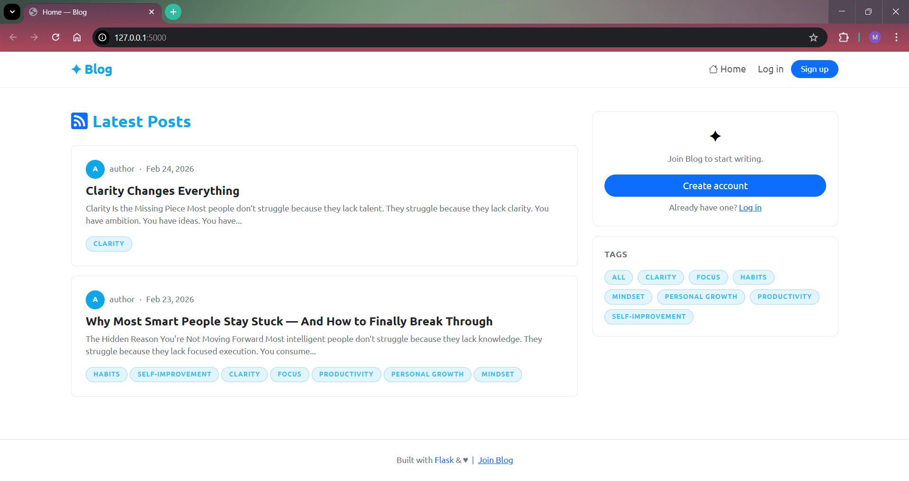
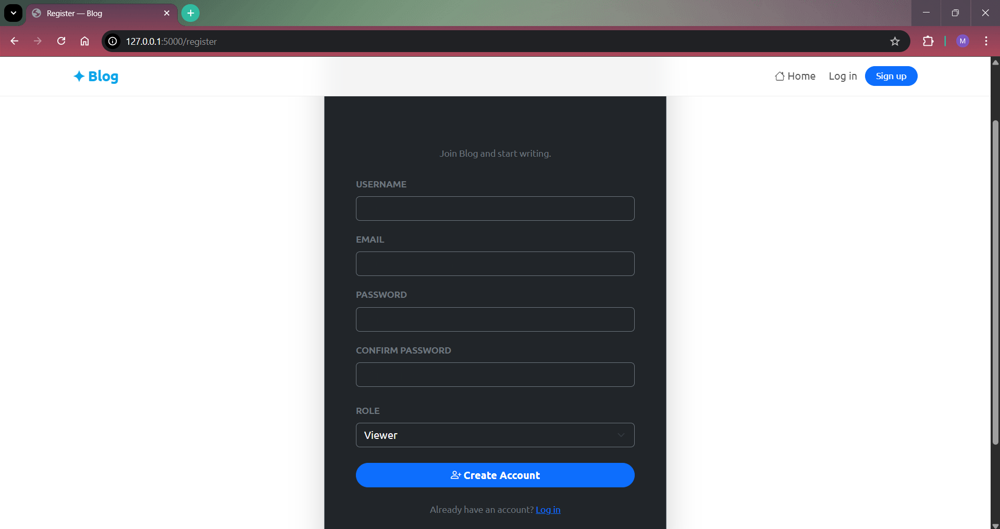
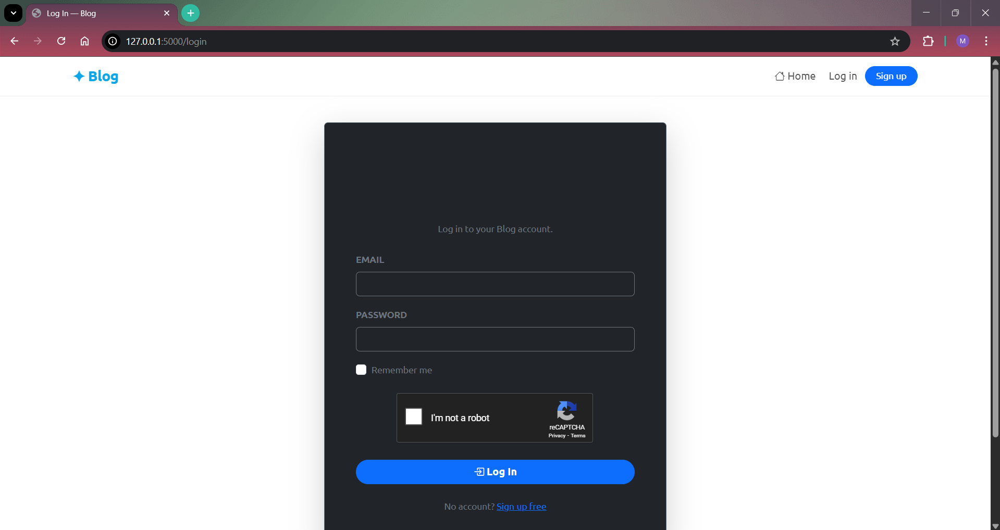
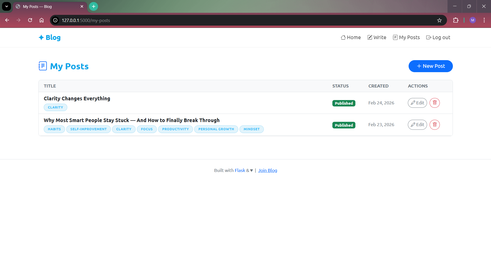
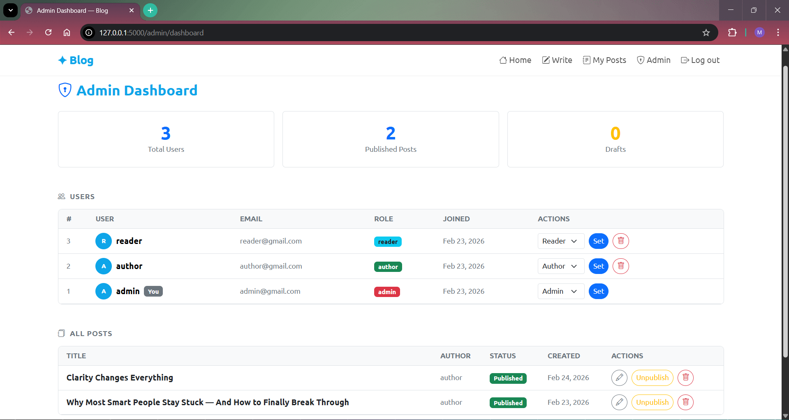

<div align="center">
  <h1>✨ Blog ✨</h1>
  <p>A modern, minimalist blogging platform built with Flask.</p>

  <p>
    
    
    
    
  </p>
</div>

---

## 📖 Overview

**Blog** is a clean, lightweight, and fully responsive blogging platform. It empowers writers to create content using Markdown, while providing readers with a beautiful, distraction-free reading experience.

Designed with a crisp white theme and vibrant Ocean Blue accents, it offers a refreshing user interface.

## ✨ Features

- 📝 **Markdown Support:** Write and format your posts easily with Markdown.
- 🎨 **Modern Design:** A clean, minimalist UI with smooth hover effects and responsive layouts.
- 🏷️ **Tagging System:** Organize your posts with customizable tags for easy discovery.
- � **Role-Based Authentication:** Secure user registration and login with roles for Readers, Authors, and Admins.
- 📱 **Mobile-Ready:** Fully responsive design that looks great on desktops, tablets, and mobile devices.
- 🛠️ **Admin Dashboard:** Effortlessly manage users, posts, and platform settings.

## 🚀 Getting Started

Follow these instructions to get a copy of the project up and running on your local machine.

### Prerequisites

- Python 3.8 or higher
- `pip` (Python package installer)

### Installation

1. **Clone the repository**

   ```bash
   git clone https://github.com/mohitparmar0602/Blogg.git
   cd Blogg
   ```

2. **Create a virtual environment**

   _On Windows:_

   ```bash
   python -m venv venv
   venv\Scripts\activate
   ```

   _On macOS/Linux:_

   ```bash
   python3 -m venv venv
   source venv/bin/activate
   ```

3. **Install dependencies**

   ```bash
   pip install -r requirements.txt
   ```

4. **Initialize the Database**

   The application uses SQLite. The databases will be configured and created automatically upon the first run.

5. **Run the Application**
   ```bash
   python app.py
   ```
   _The application will be available at [http://127.0.0.1:5000](http://127.0.0.1:5000)._

## 🛠️ Tech Stack

### Backend

- **Framework:** Flask
- **Database:** SQLite with SQLAlchemy ORM
- **Markdown Processing:** Markdown2

### Frontend

- **Design Framework:** Bootstrap 5
- **Styling:** Custom Vanilla CSS
- **Icons:** Bootstrap Icons

## 📸 Screenshots

_(To display the screenshots you just shared, save them to your `app/static/assets/` folder and update the filenames below)_

### **Home Page**



### **Register / Login**

 

### **My Posts Dashboard**



### **Admin Dashboard**



This project is licensed under the MIT License - see the `LICENSE` file for more details.

---

<div align="center">
  <i>Developed with ❤️ by <a href="https://github.com/mohitparmar0602">Mohit Parmar</a></i>
</div>
